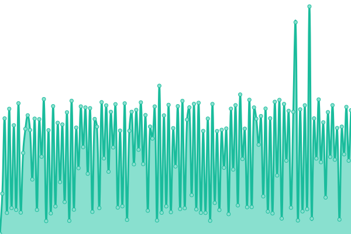
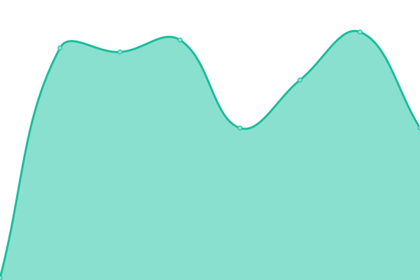
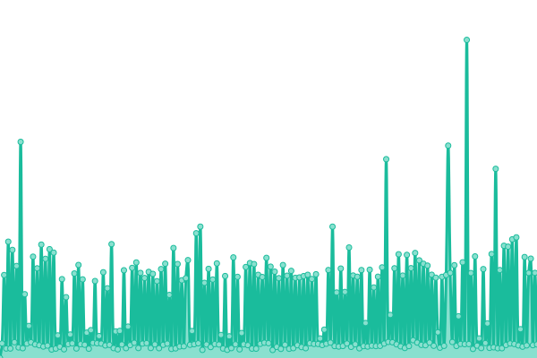

# [📈 Live Status](https://drphil3d.github.io/uptime): <!--live status--> **🟧 Partial outage**

This repository contains the open-source uptime monitor and status page for [Philip Mally](www.vectormfg.net), powered by [Upptime](https://github.com/upptime/upptime).

With [Upptime](https://upptime.js.org), you can get your own unlimited and free uptime monitor and status page, powered entirely by a GitHub repository. We use [Issues](https://github.com/drphil3d/uptime/issues) as incident reports, [Actions](https://github.com/drphil3d/uptime/actions) as uptime monitors, and [Pages](https://drphil3d.github.io/uptime) for the status page.

<!--start: status pages-->
<!-- This summary is generated by Upptime (https://github.com/upptime/upptime) -->
<!-- Do not edit this manually, your changes will be overwritten -->
<!-- prettier-ignore -->
| URL | Status | History | Response Time | Uptime |
| --- | ------ | ------- | ------------- | ------ |
|  [NorCal Machine Works](https://norcalmachine.com) | 🟩 Up | [nor-cal-machine-works.yml](https://github.com/drphil3d/uptime/commits/HEAD/history/nor-cal-machine-works.yml) | 

 1619ms
     
 | 

<a href="https://drphil3d.github.io/uptime/history/nor-cal-machine-works">95.93%</a>
    

|  [Massage Library](https://massagelibrary.com) | 🟥 Down | [massage-library.yml](https://github.com/drphil3d/uptime/commits/HEAD/history/massage-library.yml) | 

 119ms
     
 | 

<a href="https://drphil3d.github.io/uptime/history/massage-library">0.00%</a>
    

|  [Vector Additive](https://vectoradditive.com) | 🟩 Up | [vector-additive.yml](https://github.com/drphil3d/uptime/commits/HEAD/history/vector-additive.yml) | 

 2087ms
     
 | 

<a href="https://drphil3d.github.io/uptime/history/vector-additive">90.77%</a>
    

<!--end: status pages-->

[**Visit our status website →**](https://drphil3d.github.io/uptime)

## 📄 License

- Powered by: [Upptime](https://github.com/upptime/upptime)
- Code: [MIT](./LICENSE) © [Philip Mally](www.vectormfg.net)
- Data in the `./history` directory: [Open Database License](https://opendatacommons.org/licenses/odbl/1-0/)
